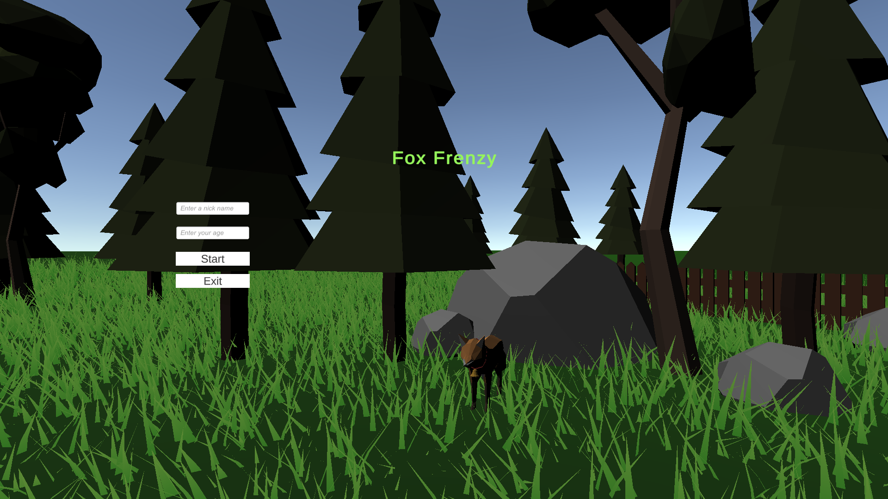

# Fox_Frenzy Spatial hearing test and measurement game.

## Background.

#

This project aims to develop a more child-friendly way to treat or detect children's eye diseases including strabismus and squints.

## Project details.

#

this project involves a game and a data analysis tool, which analysis the performance of player. The data analysis tool is in folder DataAnalysisTool, and two playable versions for mac and windows are separately in folder Game.app and GameForWindows.

## How to run the game.

#

The playable games are in folder Game.app and GameForWindows, if want to modify the game in Unity engine, the version of Unity is: 2020.3.32f1, please make sure using the same version of editor.

## Play instructions.

#

Player have to listen and allocate the exact position the sound came from and move toward to the fox that estimated true, there are fake foxes to distract the player's judgement, if find a fake fox, the player will be punished.

## Game Preview

#

When first open the game, there will be an instruction about the game background and how to play the game:

Then clicking the Play button, a sound test scene will appear to allow player cheack if their headphone works, and if they wear the headphone in correct manner:

Then Clicking on the Continue button, the start menu will appear to allow player input their name and age, also the empty input is not allowed, if input empty, a prompt word will appear to allow the player input again

What's next, clicking on the Continue button, the game begins!!!!

### Play environment.

This game is designed for touch screen, all test works are done on DELL P2418HT, the move instructs all finger gestrues, using one finger to drag to move the view angle, then using two fingers to touch the screen to move forward.

### Materials used.

Dynamic Grass FX [Link](https://assetstore.unity.com/packages/vfx/shaders/directx-11/dynamic-grass-fx-144740)  
Free Low Poly Pack [Link](https://assetstore.unity.com/packages/3d/free-low-poly-pack-65375)

### Bee_In_The_Field

You can find another game Bee_In_The_Field in here [Bee](https://github.com/jeff-Tianfeng/Bee-In-The-Field) Which is another spatial hearing testing tool.
